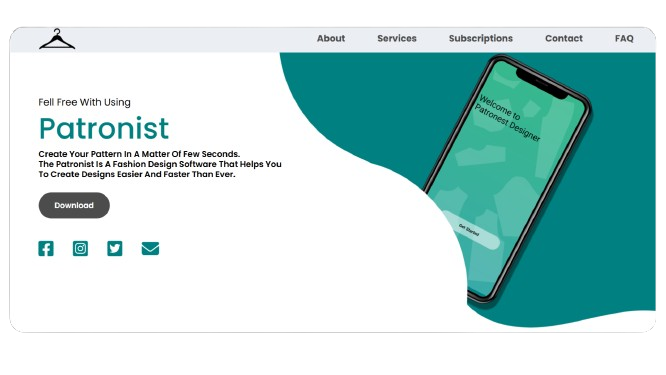

  <!-- Replace "screenshots/logo.jpg" with your actual logo or main image -->
  

## Content
- [Description](#description)
- [Features](#features)
- [Live Landing Page](#live-landing-page)
- [Main Project Repository](#main-project-repository)
- [Contact](#contact)

---

## Description
**The Patronist landing page** is the official online presence for our innovative fashion design software. It provides an overview of the application's features, benefits, and use cases, helping users understand how The Patronist simplifies pattern creation for designers of all skill levels.

This landing page serves as the primary gateway for potential users, offering a sleek design, interactive elements, and easy navigation to explore the software's capabilities.
---

## Features

- **Responsive Design:**

    Fully optimized for desktop, tablet, and mobile devices.

- **Modern UI/UX:**

    Designed with user experience in mind, featuring smooth animations and engaging visuals.

- **Overview of The Patronist:**

    Highlights key features, benefits, and how the software revolutionizes pattern creation.

- **Call to Action (CTA):**

    Encourages visitors to sign up, download the software, or learn more about the project.

- **SEO Optimization:**

    Structured for search engine visibility to reach a broader audience.

---

## Live Landing Page

  Check out the landing page for **The Patronist** here: [Visit The Patronist](https://mazenothman32.github.io/The-Patronist-Landing-Page/)

## Main Project Repository: 
You can find the source code on GitHub: [The Patronist Repo](https://github.com/MazenOthman32/The-Patronista)

## Contact
For any questions or feedback, please reach out to:

Email: MazenOthman320@gmail.com

